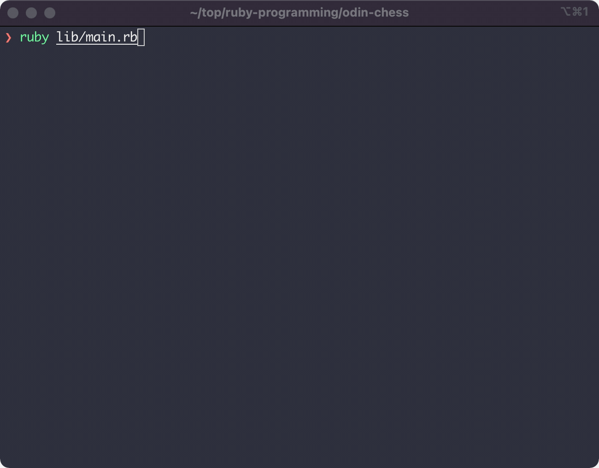

# Ruby Chess

## Overview

Final Ruby project for The Odin Project (https://www.theodinproject.com/) to create a game of chess, played through the command line.

## Demo



## How to use

The game can be run from the command line by:

1. Cloning this repo
2. Installing the required gems by running

```
$ bundle install
```
3. Then simply launch the game by running

```
$ ruby lib/main.rb
```

## Game Features

Game fully enforces the rules of chess including:
- Prevents players from making illegal moves
- Stops players from moving into check or ignoring check
- Checkmate if player has no valid moves and is in check
- Stalemate if player has no valid moves and is not in check
- Player can castle if meeting the requirements
  - King is not in check
  - King or rook has not moved
  - King does not move through a spot in check
- Pawns are able to move two squares if not already moved
- En passant only available in turn following a two-square pawn move

Additionally, the game includes a number of quality of life functions including the option select and view all available moves, save and load old games, and surrender.

## Thoughts and Takeaways

Capstone project from The Odin Project, providing the opportunity to implement everything learned through the Ruby section of the curriculum (e.g., working with basic data types, OOP and design, serialization, testing and TDD).

Beyond the technical aspects, this project provided the opportunity to get experience working with and solving a broadly scoped problem (final project did not provide any details on implementation). As such, I was required to think through the problem and implementation, maintain a disciplined workflow (utilizing git to safely experiment), stay organized, and break the problem down into workable components.
